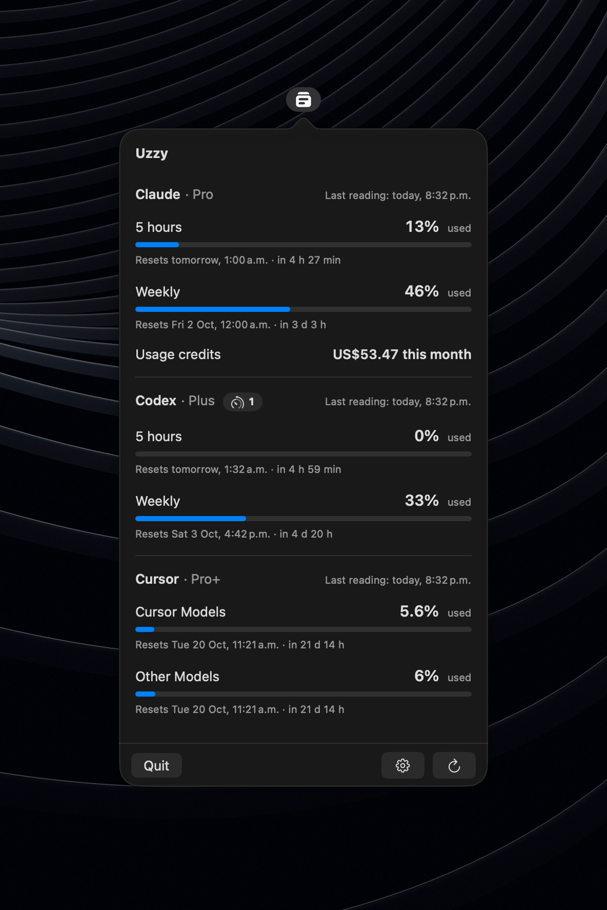
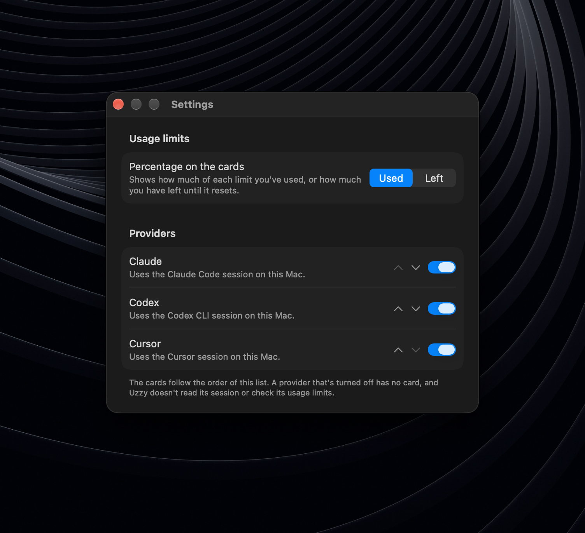

<h1 align="center">Uzzy</h1>

  <strong>Your AI tools have limits. Checking them shouldn’t be a task.</strong> 
  See how much you’ve used, how much is left and when your usage limits reset—for Claude, Codex and Cursor, in one menu bar panel.

  <a href="https://uzzy.app">uzzy.app</a> · <a href="https://github.com/aka-cronos/uzzy/releases/latest">Download</a>

  
  
  
  

  

## Why Uzzy

Keep using Claude, Codex and Cursor. Uzzy brings their usage limits together so you can stop checking each one separately. It reuses the sessions Claude Code, Codex CLI and Cursor already keep on your Mac: no extra sign-in, no API key to paste.

## Features

- **Three tools. One quick check.** Open Uzzy from your menu bar to see Claude, Codex and Cursor together, with a separate card for each enabled provider, led by its logo and showing its plan.
- **Different limits stay different.** Check each usage limit («5 horas», «Semanal», «Cursor Models»…) on its own, with its reset in local time, a countdown and how long ago it was last read. Five-hour and weekly limits are never blended into one number, and usage credits and banked resets are shown next to them.
- **Checks while you look.** Uzzy refreshes readings as you open the panel (unless the last reading is under five minutes old), then every five minutes while it stays open, and on demand with the refresh button. Close it and the requests stop.
- **Missing doesn’t mean zero.** If a session expires or a provider can’t be reached, Uzzy tells you what happened (no session, expired session, offline, incompatible response…) and the other providers keep working. When a refresh fails, the card keeps the last valid reading and marks it as out of date.
- **Native settings.** Choose whether the cards show how much is used or left, turn each provider on or off or change the order of the cards, and pick how detailed the countdown to a reset is and whether the resets available on an account are shown. The installed version and build are shown at the bottom.
- **Your language.** The interface follows the system language: English or Spanish.

  

Open Settings with ⌘, from the panel; ⌘W closes it and ⌘Q quits. Your choices are remembered across launches. A provider you turn off has no card, and Uzzy does not read its session or query its usage limits.

## Supported providers

| Provider | Session it reuses | What it shows |
|---|---|---|
| **Claude** | Claude Code (the Keychain and `~/.claude.json`) | 5 hours, weekly, and weekly per model when the plan has them; also the usage credits spent this month and their monthly limit («Créditos de uso»), when usage credits are on |
| **Codex** | Codex CLI signed in with ChatGPT (`~/.codex/auth.json` or `$CODEX_HOME`) | 5 hours, weekly, any extra limit the plan has, and the account's banked resets |
| **Cursor** | Cursor (its local `state.vscdb`) | «Cursor Models» and «Other Models» for the billing cycle |

Each card also shows the account's plan next to its title, e.g. «Claude · Max», when the provider reports a plan Uzzy knows: Claude Code keeps it in its Keychain item, Codex sends it with the usage limits and Cursor keeps it in `state.vscdb`.

Uzzy reads Claude Code's Keychain item through `/usr/bin/security`, the tool Claude Code writes it with. The item already trusts that tool, so macOS shows no Keychain prompt, even after Claude Code refreshes its token.

## Privacy

- Reuses, **read-only**, the sessions that already exist in Claude Code, Codex CLI and Cursor. It never asks for passwords, signs in, refreshes tokens or writes credentials.
- Only connects to `api.anthropic.com`, `chatgpt.com` and `api2.cursor.sh` to read usage limits, and to `api.github.com` once a day to ask for the latest version. That check sends no token and nothing about you or your usage, and you can turn it off in Settings. No telemetry and no server of its own.
- Usage data lives only in memory; nothing is written to disk.
- Display magnitude, which providers are turned on, provider order and whether to check for updates are stored in local `UserDefaults`; they contain no usage data, token, email or account identifier.

## Install

Download `Uzzy.dmg` from [uzzy.app](https://uzzy.app) or [GitHub Releases](https://github.com/aka-cronos/uzzy/releases/latest), open it and drag Uzzy to Applications. It is signed with Developer ID and notarized by Apple, so it opens like any other app.

- Requires macOS 27.0 or later on Apple Silicon.
- Requires a signed-in session in Claude Code, Codex CLI (ChatGPT mode) and/or Cursor.

To open it at login, add it under System Settings → General → Login Items.

Uzzy doesn't update itself. When a newer version is published, an **Update** button appears next to the name in the panel and downloads the new `Uzzy.dmg`; install it the same way.

To build it yourself, see [CONTRIBUTING.md](CONTRIBUTING.md).

## Contributing

See [CONTRIBUTING.md](CONTRIBUTING.md). To report a vulnerability, see [SECURITY.md](SECURITY.md).

## Disclaimer

The endpoints the app uses to read usage data are **internal and undocumented** by the providers. They may change or stop working without notice, and each person is responsible for using them within their provider's terms.

Uzzy is an independent project, not affiliated with, endorsed by or sponsored by the makers of Claude, Codex, ChatGPT or Cursor. All product names and trademarks belong to their respective owners.

## Acknowledgements

Endpoint research was informed by [OpenUsage](https://github.com/robinebers/openusage) (MIT) and [openai/codex](https://github.com/openai/codex) (Apache-2.0). No code was copied from either.

## License

[MIT](LICENSE). See [THIRD_PARTY_NOTICES.md](THIRD_PARTY_NOTICES.md) for the providers' logos and the background photo.
